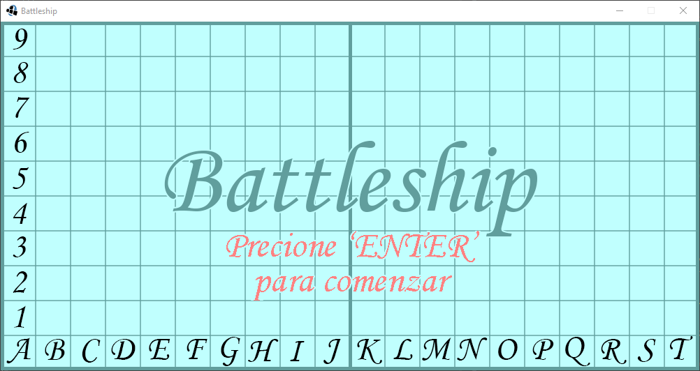
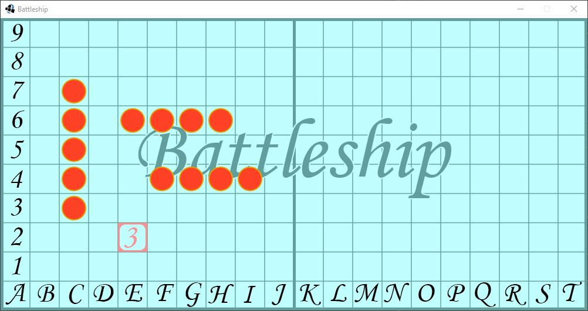
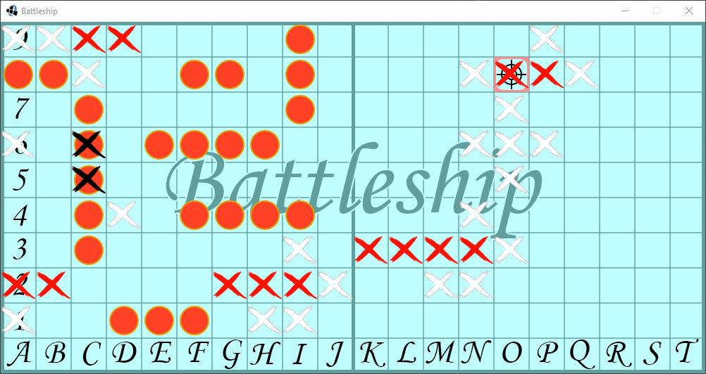

# Battleship

## Equipo de desarrollo

- Agustin Lancuba

## Capturas

## Reglas de Juego / Instrucciones

Al comenzar el juego los jugadores colocan sus barcos en el tablero.
Para colocar un barco se indica la posicion inicial y la posicion final, teniendo en cuenta cuantas casillas ocupa ese tipo de barco.
Luego se toman turnos para atacar las casillas del tablero de su contrincante.
Un barco se considera destruido cuando todas las casillas que ocupa hayan sido atacadas.
El juego termina cuando un jugador destruye todos los barcos del otro.

## Controles

- Enter: Accion
- Flechas direccionales: Mover seleccion

## Otros

- Curso K2005 / UTN / 2022
- Versión de wollok 3.0.0
- Una vez terminado, no tenemos problemas en que el repositorio sea público
